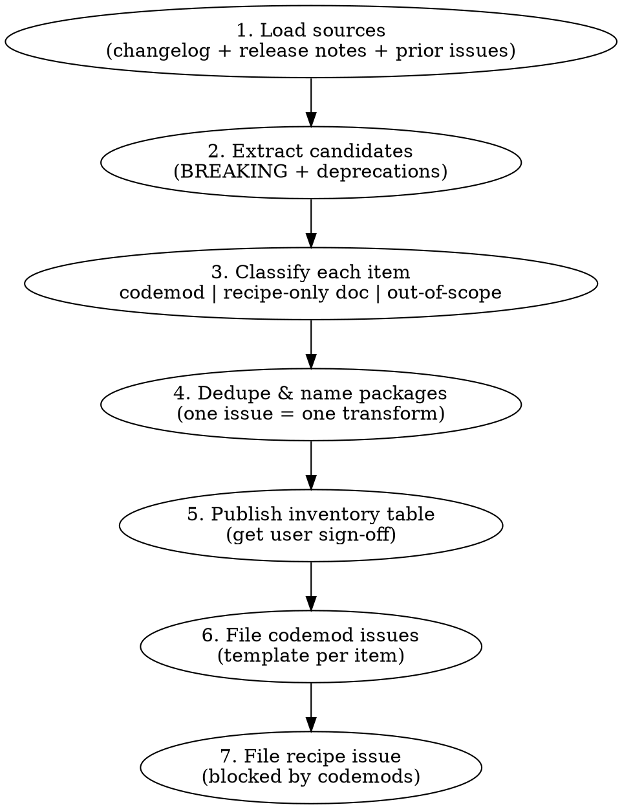

# Backstage Codemod Issue Research

Research a Backstage release and produce **GitHub issue specs** in `backstage/codemods` before anyone scaffolds code. Output is an inventory table plus one issue per codemod (and one recipe issue last).

**Handoff:** After issues are filed and approved, switch to the **`codemod` skill** ([Codemod OSS quickstart](https://docs.codemod.com/oss-quickstart)) for scaffold → implement → test → publish. This skill stops at issue bodies.

## Handoff gate (verify before implementation)

Confirm the Codemod skill is installed for this repo before handing off. Use harness **auto-detection** (omit `--harness`); pass `--harness <name>` only when the user names their agent or auto-detection fails (`claude`, `goose`, `opencode`, `cursor`, `codex`):

```bash
npx codemod ai list --format json
```

Pass when `skills` includes an entry with `"name": "codemod"` and `"scope": "project"`. Use the `path` from that entry as the skill file — install location varies by harness (e.g. `.cursor/skills/` for Cursor, different paths for Claude/Goose/OpenCode/Codex).

If missing, install per [OSS quickstart](https://docs.codemod.com/oss-quickstart):

```bash
npx codemod ai --project
```

Then **restart or reload the agent session** so the skill and Codemod MCP are picked up (see install output `restart_hint`).

Hand off with: the approved inventory table, filed issue numbers/links, and the target GitHub issue body as the implementation spec. The implementer follows the installed **`codemod` skill** (path from `codemod ai list`) plus [`CONTRIBUTING.md`](../../../CONTRIBUTING.md).

## Setup

| Gate      | Check                                         | If fail                                                                               |
| --------- | --------------------------------------------- | ------------------------------------------------------------------------------------- |
| Repo      | Working in `backstage/codemods`               | Clone or note repo URL for `gh issue create`                                          |
| Release   | Know target version (e.g. `1.<minor>.0`)      | Ask user                                                                              |
| Changelog | Consolidated changelog file available locally | Fetch from `backstage/backstage` — see Sources                                        |
| Prior art | Closed issues for previous release exist      | `gh issue list --repo backstage/codemods --state closed --search "Backstage 1.<N-1>"` |

Read [`CONTRIBUTING.md`](../../../CONTRIBUTING.md) for package naming (`@backstage/<kebab-name>`) and directory layout (`codemods/<version>/<name>/`).

## Workflow



### Step 1: Load sources

Use **all** of these — they disagree in useful ways:

| Source                  | Path / command                                                           | What it gives you                                      |
| ----------------------- | ------------------------------------------------------------------------ | ------------------------------------------------------ |
| Consolidated changelog  | `backstage/backstage/docs/releases/v1.<minor>.0-changelog.md`            | Per-package entries, diff blocks, **BREAKING** markers |
| Published release notes | `https://backstage.io/docs/releases/v1.<minor>.0`                        | User-facing framing, migration prose                   |
| GitHub release          | `gh release view v1.<minor>.0 --repo backstage/backstage`                | Same content, sometimes different emphasis             |
| Upgrade Helper          | `https://backstage.github.io/upgrade-helper/?to=1.<minor>.0`             | Dependency bumps (usually not codemod targets)         |
| Prior release issues    | `gh issue view <n> --repo backstage/codemods` for closed v1.(N-1) issues | Issue section order, aiFixup pattern, tone             |
| Existing codemods       | `codemods/v1.<prior>/` in this repo + `npx codemod search "backstage"`   | Avoid duplicate issues                                 |

Quick scan for breaking markers (from repo root):

```bash
# Substitute <minor> for the target release (e.g. 52 for 1.52.0)
python .agents/skills/backstage-codemod-issue-research/scripts/scan-changelog.py \
  ../backstage/docs/releases/v1.<minor>.0-changelog.md
```

Use the JSON output as a checklist — still read each entry manually for nuance.

### Step 2: Extract candidates

For each changelog entry, capture:

- **Package** (`@backstage/...`)
- **Symbol / API** removed, renamed, or behavior-changed
- **Replacement** (if any) and whether it is a drop-in rename vs structural migration
- **Detection signals** — imports, JSX tags, config keys, CSS classes, method names
- **Official before/after** from the changelog diff block (starting point for issue examples)

Include **deprecations** that are mechanical renames (symbol or prop renames, stable export replacements). Skip entries that are purely additive or internal refactors with "no user-facing API changes."

Apply [Codemod Issue Generator eligibility](references/codemod-issue-generator.md): only keep candidates that are statically detectable, have a clear before/after, and do not require business-logic judgment for the common case.

### Step 3: Classify

Load [`references/classification-guide.md`](references/classification-guide.md) and [`references/codemod-issue-generator.md`](references/codemod-issue-generator.md) when unsure. Summary:

| Verdict                      | Signals                                                                                                       |
| ---------------------------- | ------------------------------------------------------------------------------------------------------------- |
| **Codemod issue**            | AST-detectable pattern in TS/TSX/YAML; mechanical or semi-mechanical transform; repeated across consumer apps |
| **Recipe README only**       | Manual config / ops change; semantic behavior change; dependency resolution; no stable search pattern         |
| **Merge with another issue** | Same package + same file types + transform can run in one pass without conflicting edits                      |
| **Split issues**             | Unrelated domains (frontend JSX vs app-config YAML) or conflicting transform order                            |

**One issue = one atomic migration.** If a changelog bullet lists multiple independent changes, split them. Do not bundle unrelated breaking changes. Prefer smaller composable codemods over multi-step monsters.

Document **out-of-scope** items explicitly in the recipe issue README section — they are as important as the codemods.

### Step 4: Dedupe and name

Package name: `@backstage/<kebab-case-descriptive-name>` — verb-led when possible (`migrate-nav-item-to-page`, `rename-header-main-class`).

Issue title format (Backstage variant of [Codemod Issue Generator title](references/codemod-issue-generator.md)):

```
feat: Backstage 1.<minor>.0 migration - <short human description>
```

Worktree path (for Implementation notes): `.worktrees/feat/v1.<minor>.0/<codemod-name>`

### Step 5: Inventory table (sign-off gate)

Present a markdown table **before** filing issues:

| #   | Package | Type | Source package | aiFixup? | Notes |
| --- | ------- | ---- | -------------- | -------- | ----- |

- **Type:** breaking | deprecation
- **aiFixup?:** yes | no | maybe — decide using criteria below
- **Notes:** out-of-scope rationale, merge/split reasoning, or "changelog only — verify in source"

Wait for user confirmation on the inventory. Adjust before filing.

### Step 6: File codemod issues

Use [`references/issue-template.md`](references/issue-template.md) for each row. **Section order** follows [Codemod Issue Generator](references/codemod-issue-generator.md), plus Backstage extensions:

1. **Summary** — what changes; why required for the migration (state if NOT a drop-in rename)
2. **Detection Criteria** — implementation-ready bullets (imports, calls, JSX, config keys, CSS selectors; note test vs prod if relevant)
3. **Transformation Logic** — numbered steps; add **Prop mapping** subsection when props rename or move between nodes
4. **Before / After Example** — required unless no illustrative code applies; use labeled variants for structural migrations (e.g. basic / with error prop / nested routes)
5. **Notes / Edge Cases** — skip conditions, TODO markers, conflation warnings
6. **Optional: AI fixup step** — only when warranted (see below)
7. **Changeset (when implementing)** — package name, **minor** bump for initial release, example summary line
8. **Implementation notes** — worktree path, one PR per codemod

When filing: issue bodies are **spec only** — no inventory commentary. Do **not invent** migrations unsupported by the changelog. Use source terminology. Write for a senior implementer.

Create issues via:

```bash
gh issue create --repo backstage/codemods \
  --title "feat: Backstage 1.<minor>.0 migration - <description>" \
  --body-file /tmp/issue-body.md
```

Cross-link related issues when two migrations touch the same package (e.g. two removed APIs in `@backstage/frontend-plugin-api` — separate codemods, note the distinction in Summary).

### Step 7: Recipe issue (last)

After all codemod issues exist, file **one recipe issue** modeled on the prior release's migration-recipe issue:

- Release sequencing (codemods merge → Version Packages publish → recipe merge)
- Ordered table of registry packages aligned with release-note narrative
- aiFixup matrix (which steps support `--param aiFixup=true`)
- Out-of-scope list (manual-only changes)
- **Blocked by** — link every codemod issue number
- QA target: sample monorepo path (e.g. `../backstage`)

Reference the **prior release** migration recipe in this repo — e.g. [`codemods/v1.<prior>/migration-recipe/`](../../../codemods/) (use the highest `v1.*` directory below the target version).

## aiFixup decision

Recommend **Optional: AI fixup step** when the AST codemod will leave systematic ambiguity:

- Pairing / correlation logic (match `NavItemBlueprint` to `PageBlueprint` by `routeRef`)
- Heuristic icon or JSX rewrites (MUI → Remix)
- Partial structural migrations with TODO markers
- Namespace imports or dynamic values the AST cannot resolve

**Omit aiFixup** when the transform is fully mechanical:

- Single-symbol renames with exact references
- YAML/config key rewrites with fixed paths
- CSS class string replacements with word boundaries

When including aiFixup, specify in the issue:

- `params.schema.aiFixup` description text
- What the AST step already handles vs what AI should address (numbered lists)
- Workflow model hint (`claude-sonnet-4-6`, `max_steps: 50`) and example CLI
- Dry-run target path

Mirror aiFixup layout from closed codemod issues in the prior release — read at least one issue that ships `aiFixup` and one that does not.

## Quality bar

An issue is ready to implement when:

- [ ] Detection criteria are falsifiable (another agent can grep the sample app and predict hits)
- [ ] Transformation logic covers import + usage + cleanup (not import-only)
- [ ] Before/after compiles conceptually (types and JSX structure make sense)
- [ ] Edge cases call out **skip** conditions and **TODO(backstage-codemod)** placement
- [ ] No overlap with another issue in the same release inventory
- [ ] Changeset notes use **minor** for new packages
- [ ] Migration is explicitly supported by changelog/release notes — nothing invented
- [ ] Terminology matches the source document

## Common mistakes

**Import-only specs.** If the breaking change affects JSX structure or config shape, the Transformation Logic must describe usage rewrites — not just import path swaps.

**Conflating related migrations.** Same release may remove an API _and_ change test utilities that referenced it. Separate issues unless one codemod safely handles both.

**Config / semantics as codemods.** Catalog pagination behavior, OIDC hardening, dependency caps — document in recipe out-of-scope, do not file codemod issues.

**Missing prior-release diff.** Always read at least two closed v1.(N-1) codemod issues before filing — one with aiFixup, one without — plus that release's migration-recipe issue for section depth and tone.

**Inventing migrations.** If the changelog does not support a transform, do not file an issue — note it in the inventory or recipe out-of-scope instead.

## References

| File                                                                             | Load when                                     |
| -------------------------------------------------------------------------------- | --------------------------------------------- |
| [`references/codemod-issue-generator.md`](references/codemod-issue-generator.md) | Eligibility, granularity, generic issue shape |
| [`references/issue-template.md`](references/issue-template.md)                   | Writing issue bodies (Step 6)                 |
| [`references/classification-guide.md`](references/classification-guide.md)       | Unsure codemod vs out-of-scope (Step 3)       |
| [`scripts/scan-changelog.py`](scripts/scan-changelog.py)                         | Initial BREAKING/deprecated sweep (Step 1)    |
