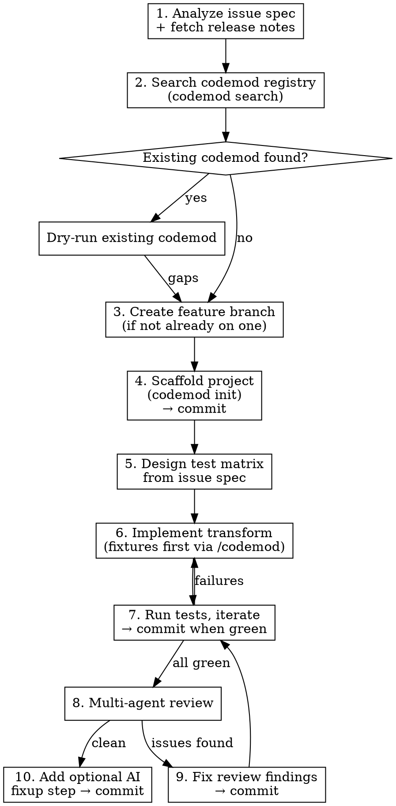

# Backstage Migration Codemod

## Overview

A complete workflow for creating production-grade JSSG codemods that migrate Backstage breaking changes. The approach is test-first: define the test matrix from the issue spec before writing any transform code, then iterate with multi-agent review until the codemod handles all real-world patterns.

**REQUIRED:** Invoke `/codemod` before starting. It loads the Codemod MCP tools (`dump_ast`, `get_jssg_instructions`, `get_jssg_utils_instructions`, etc.) and provides JSSG authoring guidance, CLI commands, scaffold setup, test commands, and import helper APIs. If `/codemod` is not installed, run `npx codemod ai` first to set up the skill and MCP server. This skill covers the Backstage-specific workflow and patterns built on top of that foundation — it does NOT repeat what `/codemod` already provides.

## When to Use

- A Backstage release introduces breaking changes requiring import path changes or API migrations
- A GitHub issue in `backstage/codemods` describes before/after transformation examples
- Deprecated exports need to be replaced with stable equivalents
- An API surface is being replaced with a different service or pattern

Do NOT use for non-Backstage codemods or changes that don't involve import/API migration.

## Workflow



## Step 1: Analyze the Issue

Each codemod targets a single Backstage release. Fetch the GitHub issue AND the corresponding release notes. Cross-reference them to identify:

- Which exports are removed or moved (the full list, not just examples)
- Which have direct replacements (same API, different path) vs. different APIs
- Which exports should NOT be migrated (still deprecated or intentionally unchanged)
- Whether the migration requires structural code changes beyond imports

Classify exports into groups based on transformation complexity — some may be simple path changes, others may require structural code changes. The number of groups depends on the migration.

## Step 2: Search the Registry First (skip to Step 3 if no match)

The `/codemod` skill requires a registry search before building. Run `npx codemod search "backstage <package-name>"`. If a match exists, dry-run it and evaluate gaps before creating a new one.

## Step 3: Create a Feature Branch

If not already on a feature branch, create one before making any changes:

```bash
git checkout -b feat/<codemod-name>
```

Use the codemod name as the branch name (e.g., `feat/catalog-node-alpha-to-stable`).

## Step 4: Scaffold

Codemods are organized by Backstage version: `codemods/v<version>/<codemod-name>/`. Scaffold with `/codemod` (`codemod init codemods/v<version>/<name> --project-type ast-grep-js --language typescript --package-manager yarn --no-interactive`). Then apply these Backstage-specific overrides:

- Change the language from `typescript` to `tsx` everywhere — test script in `package.json`, `workflow.yaml` language, and `codemod.yaml` targets. Backstage uses TSX parsing for both `.ts` and `.tsx` files, and the workflow should include both `**/*.ts` and `**/*.tsx`.
- Cast `root.root()` as `SgNode<TSX, "program">` at the top of your transform — `addImport` expects the narrower type but `root()` returns the generic kind.

Run `yarn install`, then commit the scaffolded project:

```bash
yarn install
git add codemods/v<version>/<name>/ yarn.lock
git commit -m "feat: scaffold <name> codemod"
```

## Step 5: Design the Test Matrix

The `/codemod` MCP provides general test category guidance (positive, negative, edge, no-op cases). Derive initial cases from the issue spec. In addition to those, always include these Backstage import edge cases — review agents consistently flag them when missing:

- Aliased imports (`import { foo as bar }`) — alias must be preserved
- `import type` at statement level (`import type { Foo }`) — `type` keyword must be preserved
- `import type` at specifier level (`import { type Foo, bar }`) — inline type must be preserved
- Re-exports (`export { foo } from '...'`) — different AST node kind (`export_statement`)
- Merge with existing import from the target package (both value and `import type`)
- Target package already imported with the replacement symbol — no duplicate
- Namespace imports (`import * as Ns`) — warn, don't transform
- Type exports used as type annotations after removal — warn about dangling references

Enumerate combinations explicitly — "merge with existing import" needs separate tests for value and type imports, "aliased import" needs separate tests for each transformation group.

## Step 6: Implement the Transform

Use `dump_ast` from the Codemod MCP to inspect AST structures before writing patterns. Refer to `/codemod` for JSSG API reference, `addImport`/`removeImport`/`getImport` usage, and general ast-grep pattern matching. The patterns below are Backstage-specific lessons learned.

### Import Handling Pattern

The core challenge is manipulating imports without overlapping edits. Use this hybrid approach:

**Replace the deprecated import directly** — don't use `removeImport` when you also need `addImport` for the same file, as the edit positions conflict. Instead, replace the entire deprecated import statement with a reconstructed version containing only remaining specifiers.

**Use `addImport` only for merging** into existing imports from the target package. If no existing import exists, include the new import in the replacement text.

**For `import type` merging**, `addImport` doesn't support the `type` keyword. Manually merge by extracting existing specifiers and rebuilding the statement.

### Specifier Extraction

Always extract full specifier info, not just names:

```typescript
interface SpecifierInfo {
  importedName: string;  // Original export name (for classification)
  localName: string;     // Local binding name (for reference replacement)
  specText: string;      // Full text including `as alias` and `type` prefix
}
```

Use `spec.text()` to capture the full specifier text — this automatically preserves `as` aliases and `type` modifiers. Use `importedName` for classifying which group the export belongs to. Use `localName` for finding references in the code body that need replacing.

### Reference Replacement

When replacing references (like `catalogPermissionExtensionPoint` → `coreServices.permissionsRegistry`), search for BOTH `identifier` and `type_identifier` AST node kinds:

```typescript
function findBodyReferences(rootNode, name) {
  return rootNode.findAll({
    rule: {
      any: [
        { kind: "identifier", regex: escapeRegex(name) },
        { kind: "type_identifier", regex: escapeRegex(name) },
      ],
      not: { inside: { kind: "import_specifier", stopBy: "neighbor" } },
    },
  });
}
```

### Re-export Handling

Re-exports (`export { ... } from '...'`) use `export_statement` with `export_specifier` children — different from `import_statement` / `import_specifier`. Process them separately with the same classification logic. Re-exports that can't be mechanically transformed (e.g., the replacement is a property access, not a named export) should be removed and warned about.


## Step 7: Run Tests, Iterate, and Commit

Follow `/codemod` for test commands and the iteration workflow. Once all tests and type checks pass, commit:

```bash
git add codemods/v<version>/<name>/
git commit -m "feat: implement <name> codemod with tests"
```

## Step 8: Multi-Agent Review

Spawn three review agents in parallel, each with a different lens:

1. **Codemod expert** — evaluates AST pattern quality, JSSG API usage, test coverage gaps, and correctness against the issue spec and release notes.

2. **Code reviewer** — evaluates code quality, type safety, error resilience, naming, and consistency.

3. **Devil's advocate** — adversarial review. Tries to break the codemod with edge cases: aliased imports, re-exports, `import type`, namespace imports, dynamic imports, shorthand properties, variable shadowing, double-quoted paths. Checks whether documented fixes actually work by reading both the test fixtures and the code paths.

Spawn all three using the `Agent` tool in a single message so they run concurrently. Each agent prompt must be self-contained — include the codemod directory path, the issue URL, and the release notes URL. Instruct each agent to read `scripts/codemod.ts`, all test fixtures in `tests/`, `workflow.yaml`, and `README.md`. Tell them to fetch the issue and release notes themselves to cross-reference independently.

After all three return, synthesize findings into a single prioritized list and fix the recommended items. Do not proceed past the review step until you have confidence that the findings are resolved — run additional review rounds as needed.

## Step 9: Fix Review Findings

After fixing the recommended items, re-run tests and commit:

```bash
yarn test && yarn check-types
git add codemods/v<version>/<name>/
git commit -m "fix: address review findings for <name> codemod"
```

## Step 10: Optional AI Fixup Step

Add an AI workflow step gated behind `--param aiFixup=true` for edge cases the AST codemod can't handle mechanically. See `/codemod` for AI step YAML structure (`ai:` with `prompt`, `system_prompt`, `model`, `max_steps`, and `if: "${{ params.aiFixup }}"` gating).

Typical Backstage AI fixup targets: namespace import decomposition, dep variable renaming (e.g., `catalog` → `permissions`), dangling type reference resolution, and shorthand property expansion.

When running inside a coding agent, the AI step emits `[AI INSTRUCTIONS]` and the parent agent handles the work directly — no API key needed.

After adding the AI fixup step, validate the workflow and commit:

```bash
npx codemod workflow validate -w codemods/v<version>/<name>/workflow.yaml
git add codemods/v<version>/<name>/
git commit -m "feat: add optional AI fixup step to <name> codemod"
```

## Common Mistakes

**Using `removeImport` + `addImport` together.** These produce overlapping edits when modifying the same import statement. Replace the deprecated import directly and use `addImport` only for merging into OTHER existing imports.

**Searching only `identifier` nodes.** Type annotations produce `type_identifier` in the AST. Always search both kinds when finding references to replaced symbols.
